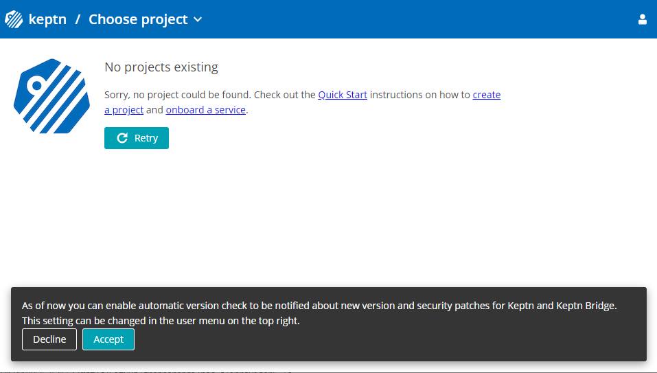
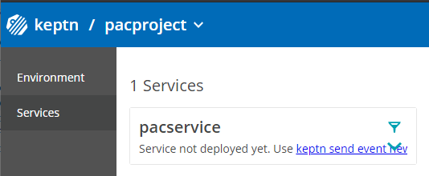
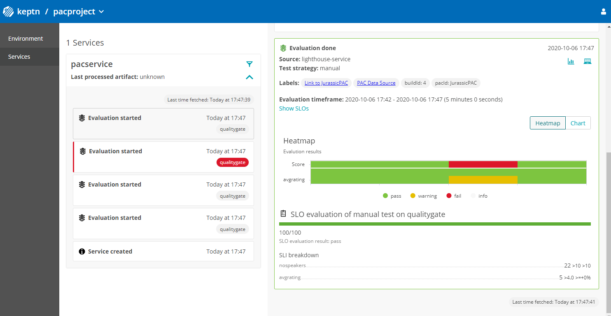
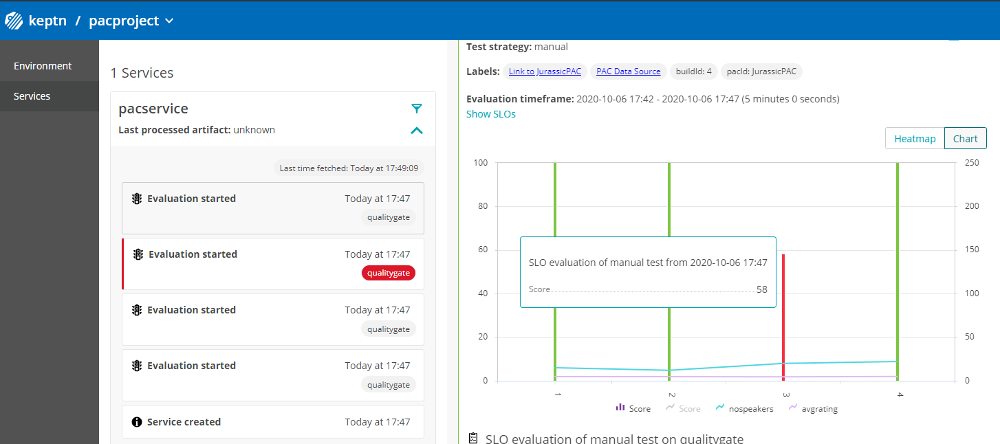

# PAC SLI Provider

This is a Keptn SLI Provider built for my talk at Neotys (Jurassic) PAC 2020: https://www.neotys.com/performance-advisory-council/andreas-grabner

It was built using the [keptn-service-template-go](https://github.com/keptn-sandbox/keptn-service-template-go/generate) repository instructions which made it really simple.

## What does the PAC SLI Provider do?

Here is a high-level overview of what this Keptn SLI (Service Level Indicator) Provider does. It can read data from a results.json file and return data points that match the passed "pacId". This sample shows that Keptn SLI Providers can be used to query any type of data source. It also shows how contextual data can be passed to Keptn to query a specific set of data and how that data is then used by Keptn to be evaluated against your SLOs (Service Level Objectives).


If you want to 
* learn more I encourage you to register for PAC and either watch me live or watch the recording!
* replicate what I have done in the demo feel free to follow along with this readme where I walk you through the full installation instructions!
* follow up with me find me on the [Keptn Slack](https://slack.keptn.sh)

## Compatibility Matrix

| Keptn Version    | [pac-sliprovider Docker Image](https://hub.docker.com/r/grabnerandi/pac-sliprovider/tags) |
|:----------------:|:----------------------------------------:|
|       0.7.x      | grabnerandi/pac-sliprovider:0.1.0 |

# Full Installation Instructions

As I have presented this for Neotys PAC event I want to give you detailed instructions on how you can replicate what I have done in my talk.
In my talk I took a t2.medium Amazon Linux 2 EC2 machine where I
* Installed Keptn based on [Keptn 0.7.1 on K3s](https://github.com/keptn-sandbox/keptn-on-k3s/tree/release-0.7.1)
* Installed my *pac-sliprovider*
* Created a Keptn *pacproject* 
* Configured the *pac-sliprovider* as SLI provider for that project
* Created a Service *pacservice* for our project *pacproject*
* Uploading SLIs & SLOs
* Executed a couple of Keptn Quality Gates

**Option 1:** Walk through all my Steps to replicate this yourself!
**Option 2:** Follow Step 1 and automate all other steps using my demosetup.sh

## Step 1 - Install Keptn

As I said - I just go with the simplest option which is Keptn on k3s. At the time of the conference Keptn 0.7.1 was the latest Keptn version so I decided to use that [0.7.1 release](https://github.com/keptn-sandbox/keptn-on-k3s/tree/release-0.7.1) on the [Keptn on K3s](https://github.com/keptn-sandbox/keptn-on-k3s) github repo. If there are newer versions available make sure to pick the latest!

In my case I launched an Amazon Linux 2 EC2 size t2.medium. Keptn on k3s only needs 1vcpu and 4GB of RAM and has been tested on a variety of platforms. Check out the [prerequisits](https://github.com/keptn-sandbox/keptn-on-k3s#prerequisites) on the Keptn on k3s github repo!

To install keptn on k3s on an AWS EC2 I just executed the following command. Please have a look at the other parameters of that installation script to best fit your setup!
```console
$ sudo curl -Lsf https://raw.githubusercontent.com/keptn-sandbox/keptn-on-k3s/0.7.1/install-keptn-on-k3s.sh | bash -s - --provider aws
```
The output of that command after its finished looks something like this
```console
#######################################>
# Deployment Summary
#######################################>
API URL   :      https://18.123.x.y/api
Bridge URL:      https://18.123.x.y/bridge
Bridge Username: keptn
Bridge Password: PASSWORDFORBRIDGE
API Token :      KEPTNAPITOKEN
To use keptn:
- Install the keptn CLI: curl -sL https://get.keptn.sh | sudo -E bash
- Authenticate: keptn auth  --api-token "KEPTNAPITOKEN" --endpoint "https://18.123.x.y/api"
```

To finish the installation just follow the two additional instructions to install the Keptn CLI and then authenticate it!
You should see an output similar to this:
```console
$ keptn auth  --api-token xxxxxxx
keptn creates the folder /home/ec2-user/.keptn/ to store logs and possibly creds.
Starting to authenticate
Successfully authenticated
Using a file-based storage for the key because the password-store seems to be not set up.
```

Now we are ready to use Keptn through the CLI.

**Accessing Keptn's Bridge**
And - you should also open a browser and access the Keptn's Bridge with the credentials in the output. Your browser will most likely tell you that its unsecure to access that site. Thats because by default Keptn on k3s installs a self-signed certificate. If you want to run keptn with a proper certificate check out the documentation. For our purpose its good and we can continue to the bridge. Should look similar to this:


## Step 2 until 7: Automate it through demosetup.sh

If you dont want to run the following steps yourself you can also execute the script demosetup.sh which you find in this repo.
Simply download it on your machine and execute it. It defaults to k3s kubectl for executing kubectl commands, pacproject, pacservice and qualitygate. If you want to change those simply export the environment variables first and then run demosetup.sh

```console
wget https://raw.githubusercontent.com/grabnerandi/pac-sliprovider/master/keptnproject/demosetup.sh
chmod +x demosetup.sh
./demosetup.sh
```

## Step 2 - Install my PAC SLI Provider

Keptn is an event-driven control plane which means it issues events to trigger different activities, e.g: deploy, test, get sli data, validate, ...
A Keptn Service - such as my PAC SLI Provider - needs to be installed on the Keptn k8s cluster and needs to subscribe to the events that the servie wants to handle.
As of Keptn 0.7.x we do this by simply applying the deployment yaml which will deploy my pac-sliprovider as a pod.

As we are running k3s we can simply use *k3s kubectl* to execute an apply command and take the deployment file from this git repo:

```console
$ k3s kubectl -n keptn apply -f https://raw.githubusercontent.com/grabnerandi/pac-sliprovider/master/deploy/service.yaml
```

To validate the installation we can get the list of running pods in the keptn namespace. You should see the default keptn services including our pac-sliprovider
```console
$ k3s kubectl -n keptn get pods
NAME                                     READY   STATUS    RESTARTS   AGE
api-gateway-nginx-784dd975b9-4jdkd       1/1     Running   0          19m
eventbroker-go-65547c496f-t8ndg          1/1     Running   0          19m
api-service-6886df69dc-vbh9m             1/1     Running   0          19m
bridge-84754954bd-8xd6g                  1/1     Running   0          19m
mongodb-5cd5ff8454-tdrbf                 1/1     Running   0          19m
keptn-nats-cluster-0                     3/3     Running   0          19m
remediation-service-58b6b4f9d5-txp4n     2/2     Running   2          19m
shipyard-service-84764d9c5d-q499l        2/2     Running   2          19m
mongodb-datastore-78f5ff6b8f-wptlj       2/2     Running   2          19m
lighthouse-service-5d84df8db-4wnnb       2/2     Running   2          19m
configuration-service-769bc757df-zqt9b   2/2     Running   2          19m
pac-sliprovider-7656d4647b-gg76t         2/2     Running   0          13s
```

## Step 3 - Create a Keptn Project for PAC

Keptn is organized in projects where a project has one or many stages. To create a new project we need a so called *shipyard.yaml* that describes the stages and what should happen in these stages. In our case we use Keptn only for Quality Gates and we only want to do this for a single stage. So - our *shipyard.yaml* is very simple:

```yaml
stages:
- name: "qualitygate"
```

If you want to learn more about Shipyard and the other Keptn use cases such as Performance as a Self-Service, Progressive Delivery or Auto-Remediation check out the various tutorials on https://tutorials.keptn.sh 

I've uploaded the shipyard file to this GitHub repo. In order to use it we simply download it by e.g: using wget or curl and then use it with the *keptn create project* command:

```console
$ wget https://raw.githubusercontent.com/grabnerandi/pac-sliprovider/master/keptnproject/shipyard.yaml
$ keptn create project pacproject -s=shipyard.yaml
WARNING: Creating a project without Git upstream repository is not recommended.
You can configure a Git upstream repository using:

keptn update project PROJECTNAME --git-user=GIT_USER --git-token=GIT_TOKEN --git-remote-url=GIT_REMOTE_URL

Starting to create project
ID of Keptn context: 681eb93a-c6ec-48b8-8761-792a3ddce477
Project pacproject created
Stage qualitygate created
Project successfully created
```

As you can see from the output. It is recommend to also set an upstream git as Keptn internally keeps all files in a git repository managed by Keptn's configuration service. In our example I skip this step as its not necessary. If you still want to set an upstream git to e.g: point to a GitHub repo you can do this via the *keptn update project* command shown in the console output.

**Validate status in Keptn's Bridge**
If you refresh your browser you will also see the new project being created!


## Step 4 - Configure PAC Provider for our Project

As of Keptn 0.7.x each Keptn project can have one SLI Provider that should be used when pulling in SLI data for quality gate evaluation. This will change in the future though to support multiple SLI providers.
In order to tell Keptn which SLI provider we have to create a ConfigMap that links our pac-sliprovider to the pacproject. In the future this should be covered through a Keptn CLI command as explained in [Issue 2483](https://github.com/keptn/keptn/issues/2483)

I've prepared a configMap for our pacproject which we can apply using kubectl:

Here is the configmap:
```yaml
apiVersion: v1
data:
  sli-provider: pac-sliprovider
kind: ConfigMap
metadata:
  name: lighthouse-config-pacproject
  namespace: keptn
``` 

And here now the command to apply it
```console
$ k3s kubectl -n keptn apply -f https://raw.githubusercontent.com/grabnerandi/pac-sliprovider/master/keptnproject/lighthouse-configmap.yaml
configmap/lighthouse-config-pacproject created
```

## Step 5 - Create a service

A Keptn project not only has a defined set of stages. A Keptn project also has services which typically refer to your micro-services or applications you want keptn to provide testing, quality gate, delivery or remediation services for. In our case we simply create a service called *pacservice* that we will use to trigger our quality gates

```console
$ keptn create service pacservice -p=pacproject
Starting to create service
ID of Keptn context: 3ef375d5-2c48-4514-ada8-0ef58f9673f4
Creating new Keptn service pacservice in stage qualitygate
```

**Validate in Keptns Bridge**
In the bridge we can click on the project and validate that the pacservice was successfully created!


## Step 6 - Uploading SLO.yaml

I suggest you read up on SLIs and SLOs and how they are used by Keptn Quality Gates. In our example we also have to upload an SLO.yaml and an SLI.yaml so that when we ask Keptn to query the SLI Provider for metrics the SLI provider knows which metrics to query and Keptn's Lighthouse service knows how to analyze them.
For this we first download two files from this repo to your local machine and then upload them to keptn using *keptn add-resource*

```console
$ wget https://raw.githubusercontent.com/grabnerandi/pac-sliprovider/master/keptnproject/slo.yaml
$ wget https://raw.githubusercontent.com/grabnerandi/pac-sliprovider/master/keptnproject/pac-sliprovider/sli.yaml
```

Now we upload the slo.yaml for that project, service and stage. The SLO.yaml goes into the root directory and has to have the name slo.yaml:
```console
$ keptn add-resource --project=pacproject --service=pacservice --stage=qualitygate --resource=slo.yaml
Adding resource slo.yaml to service pacservice in stage qualitygate in project pacproject
Resource has been uploaded.
```

The SLI.yaml is specific to the provider and per convention needs to be stored in a subdirectory called like the Keptn Service - in our case thats the *pac-sliprovider*. To specify that correct upload Uri we use the --resourceUri parameter where we specify foldername/filename:
```console
$ keptn add-resource --project=pacproject --service=pacservice --stage=qualitygate --resource=sli.yaml --resourceUri=pac-sliprovider/sli.yaml
Adding resource sli.yaml to service pacservice in stage qualitygate in project pacproject
Resource has been uploaded.
```

## Step 7 - Executing Quality Gates

Now we are all set and can send Keptn some quality gate evaluation requests. The easiest is to do this via the Keptn CLI:

```console
$ keptn send event start-evaluation --project=pacproject --service=pacservice --stage=qualitygate --labels=pacId=FirstPAC,buildId=1
Starting to send a start-evaluation event to evaluate the service pacservice in project pacproject
ID of Keptn context: f80a65a3-f3c7-4b28-ac84-1da0dfd915a9
```

Best way to look at Quality Gate results is through the Keptns Bridge where we now see the first evaluation result. The results not only include the values for the two SLIs (number of speakers and average rating), it also includes a link back to the data source as well as to the PAC Website:


Now lets execute a couple of additional evaluations. The PAC SLI Provider allows us to query data from the results.json based on the pac id. Here some additional commands we can try out:
```console
$ keptn send event start-evaluation --project=pacproject --service=pacservice --stage=qualitygate --labels=pacId=MountainPAC,buildId=2
```

```console
$ keptn send event start-evaluation --project=pacproject --service=pacservice --stage=qualitygate --labels=pacId=FuturePAC,buildId=3
```

```console
$ keptn send event start-evaluation --project=pacproject --service=pacservice --stage=qualitygate --labels=pacId=JurassicPAC,buildId=4
```

**Analyze results in the Bridge**
And here we go - all results in the bridge


And we can also switch to chart view to see historical trends -> now we see why one of the PACs was violating our SLOs :-)



## Last Step - Uninstall

If you don't want to keep your Keptn on k3s installation around you can easily delete it. Simply run:
```console
$ k3s-uninstall.sh
```

# Stay in touch!

There is a lot to learn from this example which I cover in the Neotys PAC talk. I hope you find time to watch it. Or - feel free to reach out at any time by signing up for our [Keptn Slack](https://slack.keptn.sh) where you can find me.


# License

Please find more information in the [LICENSE](LICENSE) file.
